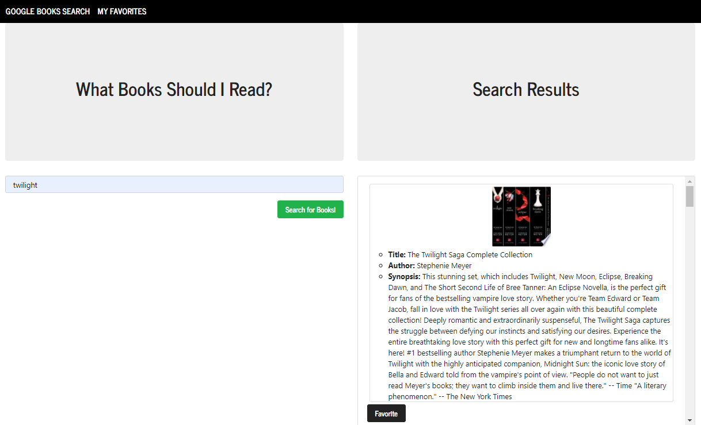
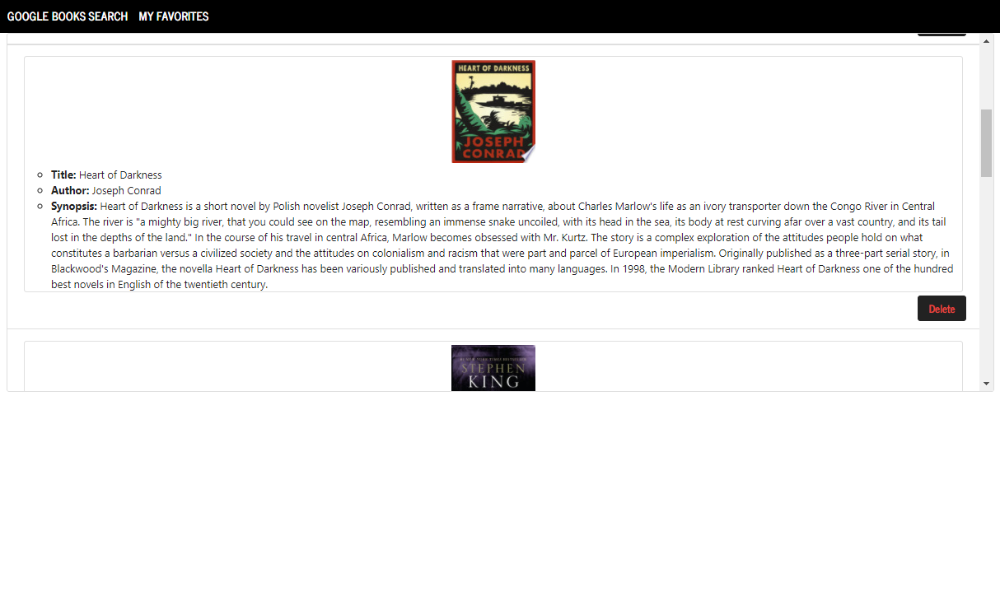
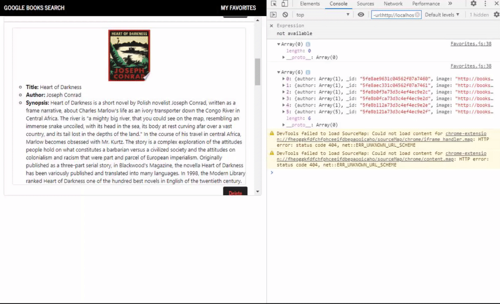
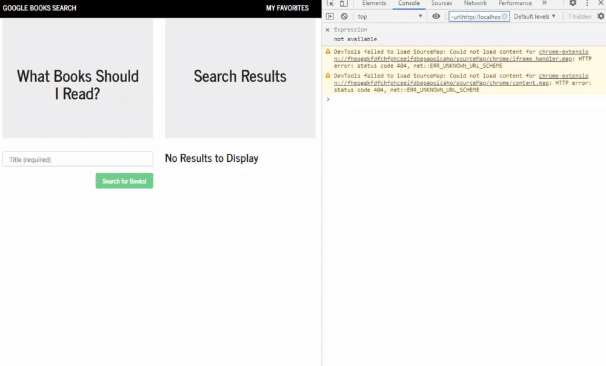

# Google Books Search App

## Deployed
* [Deployed App](https://googl-book-search.herokuapp.com/)
* [Repository](https://github.com/celineross/google-books-search)

## Author

Celine Ross

## Description

This app connects with the Google Books API, and uses React and MongoDB to store favorite books into a separate page..

 

 

 

## Requirements

Express, Node, Mongoose, MongoDB, React, React Router, Axios.

## Installation

After setting up dependencies, perform an npm install. Enter npm install [package name] for additional packages.

## Usage

App is deployed onto heroku, click link above to access.

## License

ISC

## Contribution

Please contact me if you'd like to contribute to this project.
